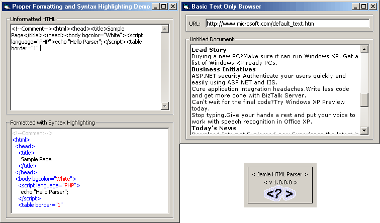



## HTML Parser \- throw away WebBrowser control manipulate HTML with ease, incl\. demos

### Description

*** Throw away the incredibly over-used Web Browser Control, make your own ***

This is first control of its kind on PSC. It parses HTML and then fires events on the beginning of tags, tag properties and their values, the ending of tags (the end of the beginning tag) the closing of tags (</close>), and the text in between tags allowing you to do practically everything with HTML. Yeehaw! Extract information with ease (link spider, e-mail harvester), manipulate tags

like never before, create blisteringly fast syntax highlighters

(see the demo), even your own web browser! (see the demo) it uses only the MS RTF box. Please vote and support PSC. Look for a tutorial soon :).
 
### More Info
 
HTML code

Have fun

Fires events based on the HTML

             |
---                |---
**Submitted On**   |2001-09-01 17:24:56
**By**             |[Jameson Schriber](https://github.com/Planet-Source-Code/PSCIndex/blob/master/ByAuthor/jameson-schriber.md)
**Level**          |Advanced
**User Rating**    |4.7 (93 globes from 20 users)
**Compatibility**  |VB 5\.0, VB 6\.0, ASP \(Active Server Pages\) , VBA MS Access, VBA MS Excel
**Category**       |[Internet/ HTML](https://github.com/Planet-Source-Code/PSCIndex/blob/master/ByCategory/internet-html__1-34.md)
**World**          |[Visual Basic](https://github.com/Planet-Source-Code/PSCIndex/blob/master/ByWorld/visual-basic.md)
**Archive File**   |[HTML Parse25737912001\.zip](https://github.com/Planet-Source-Code/jameson-schriber-html-parser-throw-away-webbrowser-control-manipulate-html-with-ease-incl-__1-26877/archive/master.zip)

